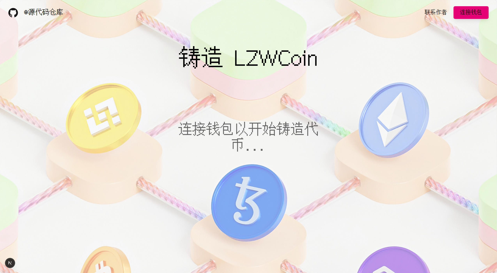
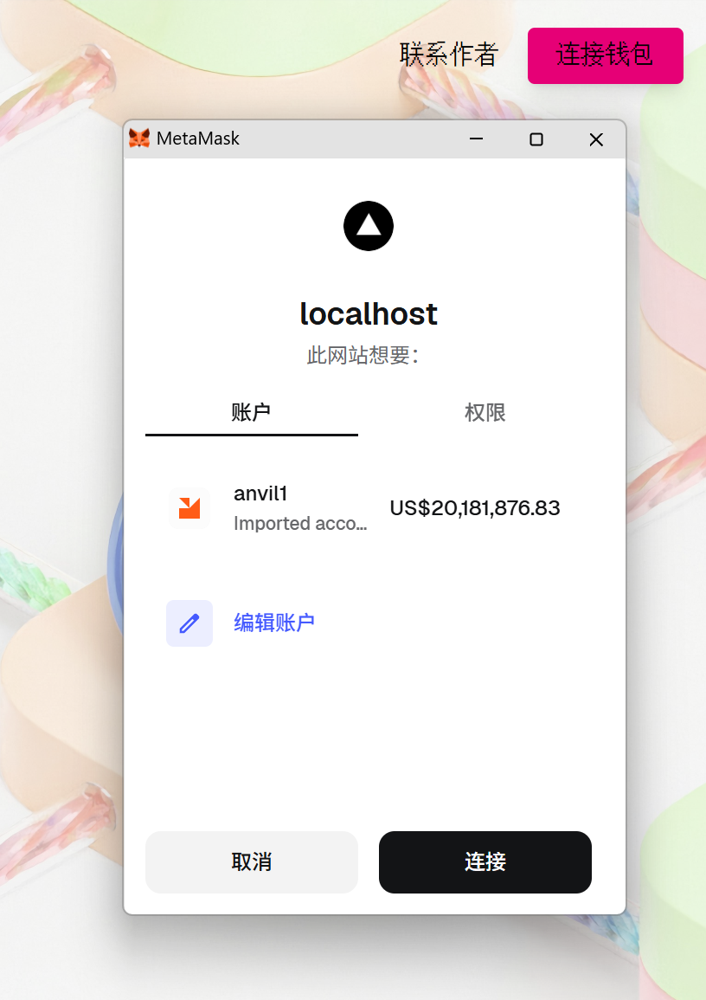
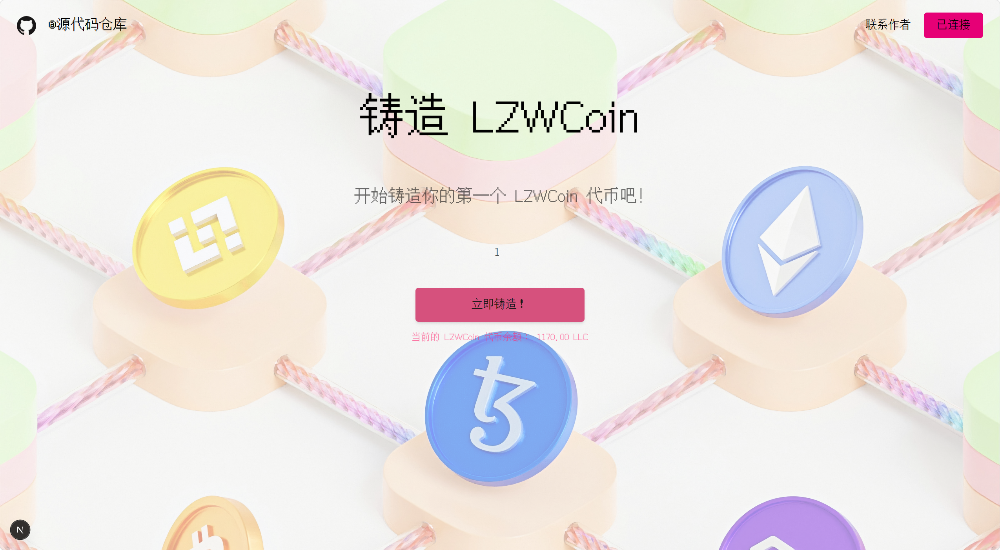

# ERC-20 Mint 

## 项目定位与边界
- 这是 ERC20 起点项目：用 `Foundry + Next.js` 跑通“部署合约 -> 前端写链 -> 链上读数”最小闭环。
- 合约边界非常明确：`mint` 和 `burn` 都是 `onlyOwner`，普通用户只做读取。

## 角色与核心对象
| 角色 | 职责 | 关键对象 |
| --- | --- | --- |
| Owner（部署者） | 部署 `LZWCoin`，执行 `mint/burn` | `OWNER_PRIVATE_KEY`、`OWNER_ADDRESS` |
| User（前端连接钱包） | 读取余额与总供应量，观察状态变化 | 钱包地址、`balanceOf` |
| 合约 `LZWCoin` | 维护 ERC20 状态与权限 | `Mint/Burn` 事件、`totalSupply` |


## 业务主流程
1. 用户打开页面并连接钱包。
2. 前端读取合约地址（`frontend/.env.local`）和 ABI。
3. Owner 点击铸造按钮，前端发起 `mint(uint256)` 交易。
4. 合约校验 `onlyOwner`，通过后 `_mint(msg.sender, amount)`。
5. 链上状态变化：`totalSupply` 增加，Owner 余额增加，触发 `Mint` 事件。
6. 前端等待回执并重新读取 `balanceOf` / `totalSupply`。
7. 页面回显新余额，完成“用户动作 -> 链上变化 -> 前端回显”闭环。

## 快速开始
### 一键启动
```
make dev
```

## Demo 展示




## 感谢
-  `claude` `deepseek` `claude code` `lllu_23`
